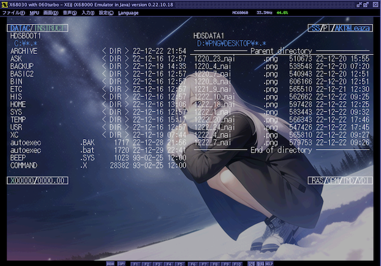

# PNGEX.X

A simple PNG image loader for X680x0 with XEiJ extended graphic support

X680x0用のシンプルなPNG画像ローダです。[XEiJ](https://stdkmd.net/xeij/)の[拡張グラフィック画面](https://stdkmd.net/xeij/feature.htm#extendedgraphic)に対応しており、最大768x512x32768色の表示が可能です。それ以上のサイズはクリップされます。

実機や他のX68エミュレータでは最大512x512にクリップされます。

---

### インストール方法

PNGEXxxx.ZIP をダウンロードして展開し、PNGEX.X をパスの通ったディレクトリに置きます。

---
### 使い方

引数をつけずに実行するか、`-h` オプションをつけて実行するとヘルプメッセージが表示されます。

    PNGEX - PNG image loader for X680x0 version 0.x.x by tantan
    usage: pngex.x [options] <image.png>
    options:
       -v<n> ... 明るさ (1-100, デフォルト100)
       -c ... 画面クリアしてから表示します
       -e ... XEiJの拡張グラフィックを使用し、最大768x512x32768色の表示を行います
       -h ... show this help message

`-e`オプションを使うにはXEiJ自体の設定で拡張グラフィックをあらかじめ有効にしておく必要があります。

060loadhigh.x を使ったハイメモリ上での実行に対応しています。

---

### Special Thanks

* XEiJ thanks to M.Kamadaさん
* xdev68k thanks to ファミべのよっしんさん
* HAS060.X on run68mac thanks to YuNKさん / M.Kamadaさん / GOROmanさん
* HLK301.X on run68mac thanks to SALTさん / GOROmanさん

---

### 変更履歴

- version 0.9.0 (2023.03.23) ... コマンドラインオプションを整理した
- version 0.1.0 (2022.12.25) ... 初版